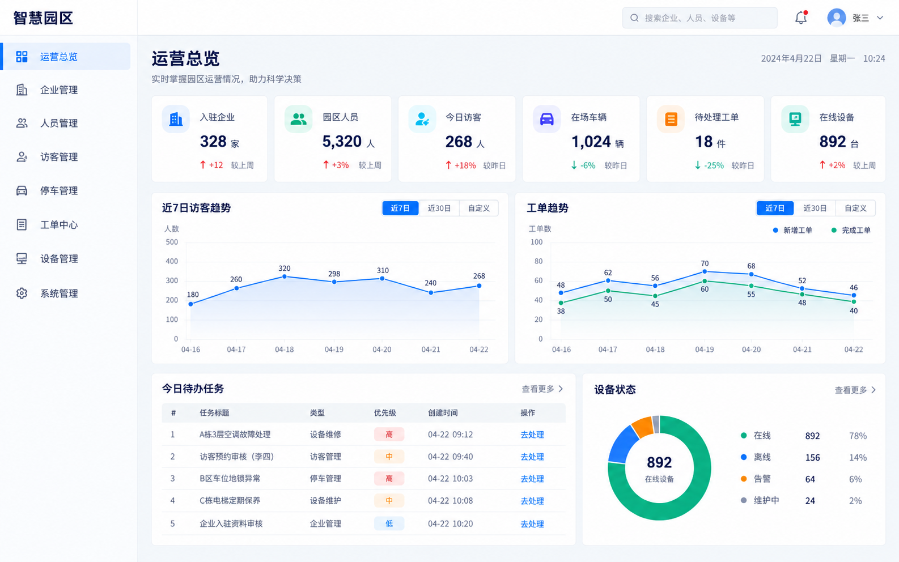
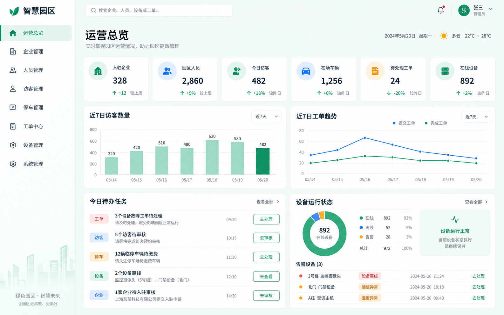
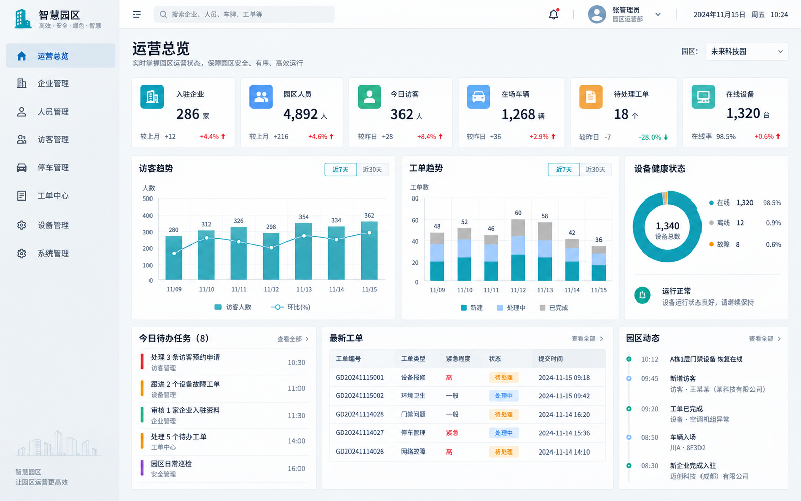
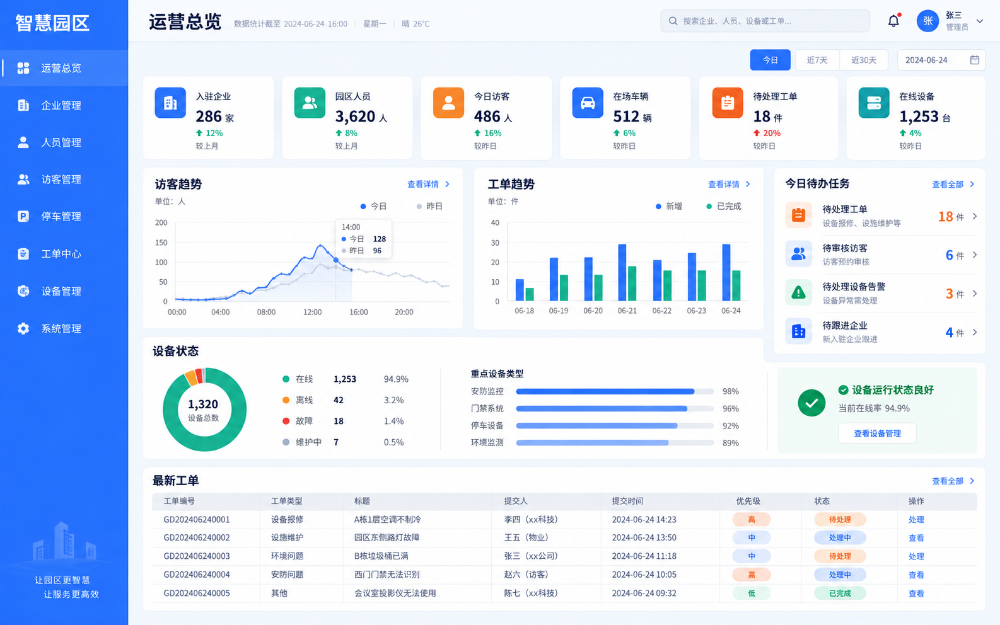
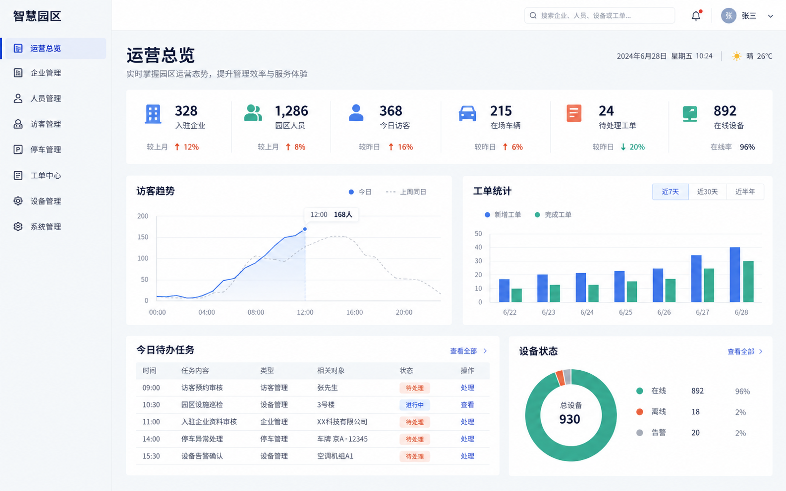

# 智慧园区 UI 视觉方向

五套方案均以“运营总览”为同一比较页面，保持相近的信息结构，只改变视觉语言。所有图片均由内置 ImageGen 生成，用于方向评审，不作为像素级实现稿。

> 已选择“01 理性蓝”作为项目整体视觉方向，完整页面设计稿见 [理性蓝页面设计稿](../ui-designs/rational-blue/README.md)。

## 方向对比

| 编号 | 方向 | 视觉特点 | 适用判断 |
| --- | --- | --- | --- |
| 01 | 理性蓝 | 白底、标准蓝、细边框、适中信息密度 | 最稳妥，适合作为通用政企后台基线 |
| 02 | 生态绿 | 薄荷浅底、绿色主色、蓝色辅助 | 园区属性最明显，氛围亲和 |
| 03 | 工业青 | 钢灰底、青色主色、紧凑网格、小圆角 | 运营感最强，适合设备与数据密集场景 |
| 04 | 活力橙蓝 | 蓝色结构、橙色任务强调、行动按钮突出 | 业务推动感强，状态识别直接 |
| 05 | 克制中性 | 大面积白色、排版主导、减少卡片边界 | 最轻盈成熟，适合追求长期耐看的产品 |

## 效果图

### 01 理性蓝



### 02 生态绿



### 03 工业青



### 04 活力橙蓝



### 05 克制中性



## 生成提示词

五套方案使用以下共同提示词结构：

```text
Use case: ui-mockup
Asset type: high-fidelity desktop web admin dashboard concept
Primary request: 为“智慧园区”生成可落地的桌面管理后台“运营总览”页面
Subject: 左侧导航、顶部栏、六个指标、访客趋势、工单趋势、今日待办、设备状态
Composition: 1440×900 正视全屏截图，真实后台信息层级和图表比例
Text: “智慧园区”“运营总览”“企业管理”“人员管理”“访客管理”“停车管理”“工单中心”“设备管理”“系统管理”
Constraints: 明亮、可读、可实现，无照片、无水印
Avoid: 暗黑色系、黑色大色块、米黄或纸张质感、紫粉渐变、霓虹、玻璃拟态、悬浮 3D 装饰、科幻 HUD、典型 AI 风格
```

各方向的差异提示词：

```text
01 理性蓝：冷白与浅灰背景，#1677FF 主蓝，细边框，8px 圆角，极少阴影，标准政企后台秩序
02 生态绿：薄荷浅底，#15966A 森林绿与 #2B8CE6 天蓝，10px 圆角，清新但保持专业
03 工业青：钢灰背景，#008FA8 技术青，4～6px 小圆角，紧凑网格和高信息密度
04 活力橙蓝：#246BFD 结构蓝，#F47A3A 行动橙，状态与操作更突出，友好但不消费化
05 克制中性：珍珠灰与白色，#315BD6 钴蓝、#2CA58D 薄荷绿，减少卡片框，强调排版与分隔线
```

## 评审建议

评审时建议分别对以下项目打分：品牌契合度、信息清晰度、长时间使用舒适度、实现成本和扩展到列表/表单页面的一致性。确定方向后，再统一提炼颜色、字号、间距、圆角、阴影和图表规范。
